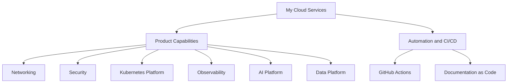

# My Cloud Services: High Level Design

## Document Control

| Field | Value |
|---|---|
| Product | My Cloud Services |
| Product Key | `greenfield-cloud-platform` |
| Version | 1.0 |
| Status | Active |
| Owner | Cloud Engineering |
| Generated Date | 2026-07-30 |
| Source Repository | `jijeeshlearningorg/greenfield-code` |
| Source Pull Request | `2/merge` |
| Source PR Title |  |
| Generation Mode | `product-centric` |

---

## Agent Context

| Agent File | Loaded |
|---|---|
| impact-agent.md | Yes |
| hld-agent.md | Yes |
| lld-agent.md | Yes |
| diagram-agent.md | Yes |

### HLD Agent Summary

# High Level Design Agent ## Role You are an Enterprise Architect and Documentation Agent. Your responsibility is to generate a complete High-Level Design (HLD) document from: - Source code - Pull request information - Existing documentation - HLD template

---

## Contents

- #document-control
- [Introduction](#introduction)
- [Product Design Overview](#product-design-overview)
- [Core Platform Capabilities](#core-platform-capabilities)
- #technology-stack
- [High Level Design Overview](#high-level-design-overview)
- #security-and-compliance
- #availability-scalability-and-operations
- #source-traceability
- #related-low-level-designs
- #open-questions

---

## Introduction

### Purpose

Provide an enterprise-grade private and hybrid cloud platform capable of delivering virtual machines, container platforms, automation services and cloud integrations.

This HLD is generated as a product-centric architecture document. Source code changes are used to identify impacted capabilities, but the HLD remains aligned to the overall product architecture.

### Audience

- Enterprise Architects
- Solution Architects
- Cloud Engineers
- Operations Teams
- Security Teams
- Service Delivery Teams

### Scope

#### Deliverables in Scope

- VMware Cloud Foundation
- Software Defined Networking
- Compute Virtualization
- vSAN Storage
- Container Platform Services
- API Driven Service Delivery
- Lifecycle Management
- Monitoring and Reporting
- Security and Compliance
- Disaster Recovery
- Multi-Tenancy
- Public Cloud Integration

#### Deliverables Out of Scope

- Customer Specific Application Support
- Customer ITSM Integration Projects
- Managed Operating System Services
- Application Development Services
- Non Standard Hardware Integrations

---

## Product Design Overview

My Cloud Services is a private and hybrid cloud platform built on VMware Cloud Foundation providing compute, storage, networking, automation, monitoring, security, disaster recovery, container and multi-tenancy capabilities.

The product is represented as a set of architectural capabilities rather than a one-to-one mapping of source files, functions or playbooks. This allows the HLD to describe the complete product solution.

---

## Core Platform Capabilities

| Capability | Description | Technologies |
| --- | --- | --- |
| Ai Platform | Ai Platform | TBD |
| Data Platform | Data Platform | TBD |
| Kubernetes | Kubernetes | TBD |
| Networking | NSX-T based virtual networking, routing, segmentation and connectivity services. | nsx-t, aria-network-insight |
| Observability | Observability | TBD |

---

## Technology Stack

| Technology | Category | Description |
| --- | --- | --- |
| Vsphere | Virtualization | Core VMware virtualization platform. |
| Esxi | Hypervisor | VMware ESXi hypervisor. |
| Vcenter | Virtualization Management | Centralized virtual infrastructure management. |
| Vsan | Storage | VMware software-defined storage platform. |
| Nsx T | Networking | VMware software-defined networking and security platform. |
| Aria Automation | Automation | Provisioning, orchestration and self-service automation. |
| Aria Orchestrator | Automation | Workflow automation platform. |
| Aria Operations | Monitoring | Infrastructure monitoring and operational analytics. |
| Aria Logs | Logging | Centralized log aggregation and analytics. |
| Aria Network Insight | Network Monitoring | Network visibility and analytics platform. |
| Tanzu Kubernetes Grid | Containers | Kubernetes runtime platform. |
| Tanzu Mission Control | Containers | Tanzu lifecycle and governance platform. |
| Sddc Manager | Lifecycle Management | VMware Cloud Foundation lifecycle automation. |
| Vlcm | Lifecycle Management | vSphere Lifecycle Manager. |
| Aria Suite Lifecycle Manager | Lifecycle Management | VMware Aria Suite lifecycle platform. |
| Trend Micro | Security | Endpoint protection and anti-malware. |
| Nessus | Security | Vulnerability scanning solution. |
| Hashicorp Vault | Security | Enterprise secrets and credential management. |
| Canopy Enterprise Backup | Backup | Enterprise backup platform. |
| Avamar | Backup | Backup and recovery software. |
| Data Domain | Backup | Backup storage appliance. |
| Srm | Disaster Recovery | VMware Site Recovery Manager. |
| Vsphere Replication | Disaster Recovery | VM-level replication platform. |
| Hcx | Migration | Workload mobility and migration platform. |
| Vmc | Public Cloud | VMware Cloud based public cloud integration. |
| Service Broker | Service Catalog | Self-service service delivery portal. |

---

## High Level Design Overview

### Architecture Principles

- Security by Design
- Automation First
- API First
- Infrastructure as Code
- Documentation as Code
- Multi-Tenant Ready
- Lifecycle Managed
- Cloud Native Ready

### Conceptual Architecture

### Integration Overview

- Active Directory
- DNS
- NTP
- Canopy Enterprise Backup
- Trend Micro
- Nessus
- ServiceNow
- Public Cloud Landing Zones
- VMware Cloud
- Customer ITSM Platforms

---

## Security and Compliance

- Security controls must be reviewed before generated documentation is merged.
- Secrets, keys, passwords, certificates and customer-sensitive values must not be copied into generated documents.
- Repository tokens must be stored in GitHub Secrets.
- Automation must follow least privilege access principles.
- Security capability changes must trigger HLD, LLD and security documentation review.

---

## Availability, Scalability and Operations

### Availability

Availability targets and design details should be defined at product level and refined through related LLDs and build guides.

### Scalability

The platform should support modular scaling according to the capabilities defined in the product catalog.

### Operations

- Generated documentation must be reviewed through pull request workflow.
- MkDocs navigation must be updated automatically.
- GitHub Actions logs provide workflow traceability.
- Pull request history provides review traceability.

---

## Source Traceability

### Changed Files

- `.github/documentation-map.yaml`
- `.github/workflows/test.yml`
- `scripts/detect-impact.py`
- `src/deploy.py`

### Impacted Capability Mapping

| Capability | Changed Files |
| --- | --- |
| Ai Platform | `src/deploy.py` |
| Data Platform | `src/deploy.py` |
| Kubernetes | `src/deploy.py` |
| Networking | `src/deploy.py` |
| Observability | `src/deploy.py` |

### Detected Implementation Functions

The following implementation functions were detected from changed source files. They are supporting traceability only and should not drive the HLD structure.

- `build_doc_request()`
- `build_impacted_capabilities()`
- `deploy_ai_gateway()`
- `deploy_ai_observability_platform()`
- `deploy_api_gateway()`
- `deploy_application_load_balancer()`
- `deploy_backup_replication_service()`
- `deploy_data_lakehouse()`
- `deploy_disaster_recovery_gateway()`
- `deploy_document_intelligence_service()`
- `deploy_event_stream_platform()`
- `deploy_ingress_controller()`
- `deploy_kubernetes_cluster()`
- `deploy_model_serving_endpoint()`
- `deploy_observability_stack()`
- `deploy_private_dns_zone()`
- `deploy_prompt_management_service()`
- `deploy_rag_platform()`
- `deploy_secrets_management()`
- `deploy_security_operations_platform()`
- `deploy_service_mesh()`
- `deploy_storage_gateway()`
- `deploy_stream_analytics_platform()`
- `deploy_vector_database()`
- `deploy_vpn_gateway()`
- `deploy_zero_trust_access_policy()`
- `get_pull_request_number()`
- `get_pull_request_title()`
- `get_pull_request_url()`
- `get_repository_full_name()`
- `get_repository_name()`
- `main()`
- `normalize_path()`
- `provision_zero_trust_network()`
- `read_changed_files()`
- `read_yaml()`
- `resolve_capabilities_for_changed_file()`
- `resolve_product()`
- `unique_sorted()`
- `validate_network_segmentation()`
- `write_json()`

---

## Related Low Level Designs

Detailed implementation design should be generated as LLD documents per impacted capability.

---

## Open Questions

- Should each product capability have a dedicated LLD?
- Should ADR generation be triggered for architecture-impacting capability changes?
- Should security capability changes generate a dedicated security design document?
- Should product catalog ownership be reviewed as part of the PR workflow?

