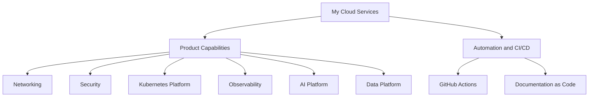

# My Cloud Services: High Level Design

## Document Control

| Field | Value |
|---|---|
| Product | My Cloud Services |
| Product Key | `my-cloud-platform` |
| Version | 1.0 |
| Status | Active |
| Owner | Cloud Engineering |
| Generated Date | 2026-07-31 |
| Source Repository | `jijeeshlearningorg/brownfield-code` |
| Source Pull Request | `main` |
| Source PR Title |  |
| Generation Mode | `product-centric` |

---

## Agent Context

| Agent File | Loaded |
|---|---|
| impact-agent.md | Yes |
| hld-agent.md | Yes |
| lld-agent.md | Yes |
| diagram-agent.md | Yes |

### HLD Agent Summary

# High Level Design Agent ## Role You are an Enterprise Architect and Documentation Agent. Your responsibility is to generate a complete High-Level Design (HLD) document from: - Source code - Pull request information - Existing documentation - HLD template

---

## Contents

- #document-control
- [Introduction](#introduction)
- [Product Design Overview](#product-design-overview)
- [Core Platform Capabilities](#core-platform-capabilities)
- #technology-stack
- [High Level Design Overview](#high-level-design-overview)
- #security-and-compliance
- #availability-scalability-and-operations
- #source-traceability
- #related-low-level-designs
- #open-questions

---

## Introduction

### Purpose

Provide an enterprise-grade private and hybrid cloud platform capable of delivering virtual machines, container platforms, automation services and cloud integrations.

This HLD is generated as a product-centric architecture document. Source code changes are used to identify impacted capabilities, but the HLD remains aligned to the overall product architecture.

### Audience

- Enterprise Architects
- Solution Architects
- Cloud Engineers
- Operations Teams
- Security Teams
- Service Delivery Teams

### Scope

#### Deliverables in Scope

- VMware Cloud Foundation
- Software Defined Networking
- Compute Virtualization
- vSAN Storage
- Container Platform Services
- API Driven Service Delivery
- Lifecycle Management
- Monitoring and Reporting
- Security and Compliance
- Disaster Recovery
- Multi-Tenancy
- Public Cloud Integration

#### Deliverables Out of Scope

- Customer Specific Application Support
- Customer ITSM Integration Projects
- Managed Operating System Services
- Application Development Services
- Non Standard Hardware Integrations

---

## Product Design Overview

My Cloud Services is a private and hybrid cloud platform built on VMware Cloud Foundation providing compute, storage, networking, automation, monitoring, security, disaster recovery, container and multi-tenancy capabilities.

The product is represented as a set of architectural capabilities rather than a one-to-one mapping of source files, functions or playbooks. This allows the HLD to describe the complete product solution.

---

## Core Platform Capabilities

| Capability | Description | Technologies |
| --- | --- | --- |
| Migration | Migration | TBD |

---

## Technology Stack

| Technology | Category | Description |
| --- | --- | --- |
| Vsphere | Virtualization | Core VMware virtualization platform. |
| Esxi | Hypervisor | VMware ESXi hypervisor. |
| Vcenter | Virtualization Management | Centralized virtual infrastructure management. |
| Vsan | Storage | VMware software-defined storage platform. |
| Nsx T | Networking | VMware software-defined networking and security platform. |
| Aria Automation | Automation | Provisioning, orchestration and self-service automation. |
| Aria Orchestrator | Automation | Workflow automation platform. |
| Aria Operations | Monitoring | Infrastructure monitoring and operational analytics. |
| Aria Logs | Logging | Centralized log aggregation and analytics. |
| Aria Network Insight | Network Monitoring | Network visibility and analytics platform. |
| Tanzu Kubernetes Grid | Containers | Kubernetes runtime platform. |
| Tanzu Mission Control | Containers | Tanzu lifecycle and governance platform. |
| Sddc Manager | Lifecycle Management | VMware Cloud Foundation lifecycle automation. |
| Vlcm | Lifecycle Management | vSphere Lifecycle Manager. |
| Aria Suite Lifecycle Manager | Lifecycle Management | VMware Aria Suite lifecycle platform. |
| Trend Micro | Security | Endpoint protection and anti-malware. |
| Nessus | Security | Vulnerability scanning solution. |
| Hashicorp Vault | Security | Enterprise secrets and credential management. |
| Canopy Enterprise Backup | Backup | Enterprise backup platform. |
| Avamar | Backup | Backup and recovery software. |
| Data Domain | Backup | Backup storage appliance. |
| Srm | Disaster Recovery | VMware Site Recovery Manager. |
| Vsphere Replication | Disaster Recovery | VM-level replication platform. |
| Hcx | Migration | Workload mobility and migration platform. |
| Vmc | Public Cloud | VMware Cloud based public cloud integration. |
| Service Broker | Service Catalog | Self-service service delivery portal. |

---

## High Level Design Overview

### Architecture Principles

- Security by Design
- Automation First
- API First
- Infrastructure as Code
- Documentation as Code
- Multi-Tenant Ready
- Lifecycle Managed
- Cloud Native Ready

### Conceptual Architecture

### Integration Overview

- Active Directory
- DNS
- NTP
- Canopy Enterprise Backup
- Trend Micro
- Nessus
- ServiceNow
- Public Cloud Landing Zones
- VMware Cloud
- Customer ITSM Platforms

---

## Security and Compliance

- Security controls must be reviewed before generated documentation is merged.
- Secrets, keys, passwords, certificates and customer-sensitive values must not be copied into generated documents.
- Repository tokens must be stored in GitHub Secrets.
- Automation must follow least privilege access principles.
- Security capability changes must trigger HLD, LLD and security documentation review.

---

## Availability, Scalability and Operations

### Availability

Availability targets and design details should be defined at product level and refined through related LLDs and build guides.

### Scalability

The platform should support modular scaling according to the capabilities defined in the product catalog.

### Operations

- Generated documentation must be reviewed through pull request workflow.
- MkDocs navigation must be updated automatically.
- GitHub Actions logs provide workflow traceability.
- Pull request history provides review traceability.

---

## Source Traceability

### Changed Files

- `src/migrate.py`

### Impacted Capability Mapping

| Capability | Changed Files |
| --- | --- |
| Migration | `src/migrate.py` |

### Detected Implementation Functions

The following implementation functions were detected from changed source files. They are supporting traceability only and should not drive the HLD structure.

- `migrate_legacy_hardware_node()`

---

## Related Low Level Designs

Detailed implementation design should be generated as LLD documents per impacted capability.

---

## Open Questions

- Should each product capability have a dedicated LLD?
- Should ADR generation be triggered for architecture-impacting capability changes?
- Should security capability changes generate a dedicated security design document?
- Should product catalog ownership be reviewed as part of the PR workflow?

---

## Generated Documentation Updates

This section contains generated documentation updates appended by the Documentation-as-Code automation. Existing manually reviewed content above this section is preserved.

---

### Generated HLD Update - 2026-07-31

<!-- DOCGEN-UPDATE-START: HLD-jijeeshlearningorg-greenfield-code-PR-main-unknown-sha-3be59764f9e6 -->

#### Update Summary

| Field | Value |
|---|---|
| Document Type | HLD |
| Product | My Cloud Services |
| Source Repository | `jijeeshlearningorg/greenfield-code` |
| Source PR Number | `main` |
| Source PR Title | Merged change |
| Source PR URL | https://github.com/jijeeshlearningorg/greenfield-code/pull/main |
| Source Commit SHA | `unknown-sha` |
| Generated Date | 2026-07-31 |

#### Impacted Capabilities

- ai-platform
- api-service-broker
- automation
- backup
- data-platform
- disaster-recovery
- kubernetes
- networking
- observability
- security

#### Changed Files

- src/automation.py
- src/backup.py
- src/deploy.py
- src/dr_platform.py
- src/security_vault.py
- src/service_broker.py

#### Generated Content

# My Cloud Services: High Level Design

## Document Control

| Field | Value |
|---|---|
| Product | My Cloud Services |
| Product Key | `my-cloud-platform` |
| Version | 1.0 |
| Status | Active |
| Owner | Cloud Engineering |
| Generated Date | 2026-07-31 |
| Source Repository | `jijeeshlearningorg/greenfield-code` |
| Source Pull Request | `main` |
| Source PR Title |  |
| Generation Mode | `product-centric` |

---

## Agent Context

| Agent File | Loaded |
|---|---|
| impact-agent.md | Yes |
| hld-agent.md | Yes |
| lld-agent.md | Yes |
| diagram-agent.md | Yes |

### HLD Agent Summary

# High Level Design Agent ## Role You are an Enterprise Architect and Documentation Agent. Your responsibility is to generate a complete High-Level Design (HLD) document from: - Source code - Pull request information - Existing documentation - HLD template

---

## Contents

- #document-control
- #introduction
- [Product Design Overview](overview)
- [Core Platform Capabilities](capability)
- #technology-stack
- [High Level Design Overview](overview)
- #security-and-compliance
- #availability-scalability-and-operations
- #source-traceability
- #related-low-level-designs
- #open-questions

---

## Introduction

### Purpose

Provide an enterprise-grade private and hybrid cloud platform capable of delivering virtual machines, container platforms, automation services and cloud integrations.

This HLD is generated as a product-centric architecture document. Source code changes are used to identify impacted capabilities, but the HLD remains aligned to the overall product architecture.

### Audience

- Enterprise Architects
- Solution Architects
- Cloud Engineers
- Operations Teams
- Security Teams
- Service Delivery Teams

### Scope

#### Deliverables in Scope

- VMware Cloud Foundation
- Software Defined Networking
- Compute Virtualization
- vSAN Storage
- Container Platform Services
- API Driven Service Delivery
- Lifecycle Management
- Monitoring and Reporting
- Security and Compliance
- Disaster Recovery
- Multi-Tenancy
- Public Cloud Integration

#### Deliverables Out of Scope

- Customer Specific Application Support
- Customer ITSM Integration Projects
- Managed Operating System Services
- Application Development Services
- Non Standard Hardware Integrations

---

## Product Design Overview

My Cloud Services is a private and hybrid cloud platform built on VMware Cloud Foundation providing compute, storage, networking, automation, monitoring, security, disaster recovery, container and multi-tenancy capabilities.

The product is represented as a set of architectural capabilities rather than a one-to-one mapping of source files, functions or playbooks. This allows the HLD to describe the complete product solution.

---

## Core Platform Capabilities

| Capability | Description | Technologies |
| --- | --- | --- |
| Ai Platform | Ai Platform | TBD |
| Api Service Broker | Service consumption layer exposing VCS functionality through APIs and service catalog. | aria-automation, service-broker |
| Automation | Automated provisioning, lifecycle management and service delivery. | aria-automation, aria-orchestrator, ansible, github-actions |
| Backup | Image and application level backup services. | canopy-enterprise-backup, avamar, data-domain |
| Data Platform | Data Platform | TBD |
| Disaster Recovery | Site protection, workload replication and recovery capabilities. | srm, vsphere-replication, vsan-stretched-cluster |
| Kubernetes | Kubernetes | TBD |
| Networking | NSX-T based virtual networking, routing, segmentation and connectivity services. | nsx-t, aria-network-insight |
| Observability | Observability | TBD |
| Security | Platform security controls, vulnerability management and compliance automation. | trend-micro, nessus, hashicorp-vault, vmware-nkp |

---

## Technology Stack

| Technology | Category | Description |
| --- | --- | --- |
| Vsphere | Virtualization | Core VMware virtualization platform. |
| Esxi | Hypervisor | VMware ESXi hypervisor. |
| Vcenter | Virtualization Management | Centralized virtual infrastructure management. |
| Vsan | Storage | VMware software-defined storage platform. |
| Nsx T | Networking | VMware software-defined networking and security platform. |
| Aria Automation | Automation | Provisioning, orchestration and self-service automation. |
| Aria Orchestrator | Automation | Workflow automation platform. |
| Aria Operations | Monitoring | Infrastructure monitoring and operational analytics. |
| Aria Logs | Logging | Centralized log aggregation and analytics. |
| Aria Network Insight | Network Monitoring | Network visibility and analytics platform. |
| Tanzu Kubernetes Grid | Containers | Kubernetes runtime platform. |
| Tanzu Mission Control | Containers | Tanzu lifecycle and governance platform. |
| Sddc Manager | Lifecycle Management | VMware Cloud Foundation lifecycle automation. |
| Vlcm | Lifecycle Management | vSphere Lifecycle Manager. |
| Aria Suite Lifecycle Manager | Lifecycle Management | VMware Aria Suite lifecycle platform. |
| Trend Micro | Security | Endpoint protection and anti-malware. |
| Nessus | Security | Vulnerability scanning solution. |
| Hashicorp Vault | Security | Enterprise secrets and credential management. |
| Canopy Enterprise Backup | Backup | Enterprise backup platform. |
| Avamar | Backup | Backup and recovery software. |
| Data Domain | Backup | Backup storage appliance. |
| Srm | Disaster Recovery | VMware Site Recovery Manager. |
| Vsphere Replication | Disaster Recovery | VM-level replication platform. |
| Hcx | Migration | Workload mobility and migration platform. |
| Vmc | Public Cloud | VMware Cloud based public cloud integration. |
| Service Broker | Service Catalog | Self-service service delivery portal. |

---

## High Level Design Overview

### Architecture Principles

- Security by Design
- Automation First
- API First
- Infrastructure as Code
- Documentation as Code
- Multi-Tenant Ready
- Lifecycle Managed
- Cloud Native Ready

### Conceptual Architecture

### Integration Overview

- Active Directory
- DNS
- NTP
- Canopy Enterprise Backup
- Trend Micro
- Nessus
- ServiceNow
- Public Cloud Landing Zones
- VMware Cloud
- Customer ITSM Platforms

---

## Security and Compliance

- Security controls must be reviewed before generated documentation is merged.
- Secrets, keys, passwords, certificates and customer-sensitive values must not be copied into generated documents.
- Repository tokens must be stored in GitHub Secrets.
- Automation must follow least privilege access principles.
- Security capability changes must trigger HLD, LLD and security documentation review.

---

## Availability, Scalability and Operations

### Availability

Availability targets and design details should be defined at product level and refined through related LLDs and build guides.

### Scalability

The platform should support modular scaling according to the capabilities defined in the product catalog.

### Operations

- Generated documentation must be reviewed through pull request workflow.
- MkDocs navigation must be updated automatically.
- GitHub Actions logs provide workflow traceability.
- Pull request history provides review traceability.

---

## Source Traceability

### Changed Files

- `src/automation.py`
- `src/backup.py`
- `src/deploy.py`
- `src/dr_platform.py`
- `src/security_vault.py`
- `src/service_broker.py`

### Impacted Capability Mapping

| Capability | Changed Files |
| --- | --- |
| Automation | `src/automation.py` |
| Backup | `src/backup.py` |
| Ai Platform | `src/deploy.py` |
| Data Platform | `src/deploy.py` |
| Kubernetes | `src/deploy.py` |
| Networking | `src/deploy.py` |
| Observability | `src/deploy.py` |
| Disaster Recovery | `src/dr_platform.py` |
| Security | `src/security_vault.py` |
| Api Service Broker | `src/service_broker.py` |

### Detected Implementation Functions

The following implementation functions were detected from changed source files. They are supporting traceability only and should not drive the HLD structure.

- `assign_key_to_service()`
- `create_customer_managed_key()`
- `create_recovery_plan()`
- `create_service_offering()`
- `create_vault_namespace()`
- `deploy_ai_platform()`
- `deploy_configuration_baseline()`
- `deploy_data_platform()`
- `deploy_kubernetes_platform()`
- `deploy_network_foundation()`
- `execute_backup()`
- `execute_platform_workflow()`
- `execute_site_failover()`
- `generate_backup_report()`
- `generate_dr_readiness_report()`
- `provision_infrastructure()`
- `publish_service_catalog()`
- `register_platform_api()`
- `rotate_encryption_key()`
- `schedule_backup_job()`
- `validate_api_subscription()`
- `validate_automation_results()`
- `validate_backup_integrity()`
- `validate_platform_observability()`
- `validate_recovery_objectives()`
- `validate_vault_policy()`

---

## Related Low Level Designs

Detailed implementation design should be generated as LLD documents per impacted capability.

---

## Open Questions

- Should each product capability have a dedicated LLD?
- Should ADR generation be triggered for architecture-impacting capability changes?
- Should security capability changes generate a dedicated security design document?
- Should product catalog ownership be reviewed as part of the PR workflow?

<!-- DOCGEN-UPDATE-END: HLD-jijeeshlearningorg-greenfield-code-PR-main-unknown-sha-3be59764f9e6 -->

---

### Generated HLD Update - 2026-07-31

<!-- DOCGEN-UPDATE-START: HLD-jijeeshlearningorg-brownfield-code-PR-main-unknown-sha-5be2937e3404 -->

#### Update Summary

| Field | Value |
|---|---|
| Document Type | HLD |
| Product | My Cloud Services |
| Source Repository | `jijeeshlearningorg/brownfield-code` |
| Source PR Number | `main` |
| Source PR Title | Merged change |
| Source PR URL | https://github.com/jijeeshlearningorg/brownfield-code/pull/main |
| Source Commit SHA | `unknown-sha` |
| Generated Date | 2026-07-31 |

#### Impacted Capabilities

- capacity-management
- lifecycle-management
- migration
- observability

#### Changed Files

- src/capacity_calc.py
- src/migrate.py
- src/patch.py
- src/rollback.py
- src/upgrade.py
- src/validation.py

#### Generated Content

# My Cloud Services: High Level Design

## Document Control

| Field | Value |
|---|---|
| Product | My Cloud Services |
| Product Key | `my-cloud-platform` |
| Version | 1.0 |
| Status | Active |
| Owner | Cloud Engineering |
| Generated Date | 2026-07-31 |
| Source Repository | `jijeeshlearningorg/brownfield-code` |
| Source Pull Request | `main` |
| Source PR Title |  |
| Generation Mode | `product-centric` |

---

## Agent Context

| Agent File | Loaded |
|---|---|
| impact-agent.md | Yes |
| hld-agent.md | Yes |
| lld-agent.md | Yes |
| diagram-agent.md | Yes |

### HLD Agent Summary

# High Level Design Agent ## Role You are an Enterprise Architect and Documentation Agent. Your responsibility is to generate a complete High-Level Design (HLD) document from: - Source code - Pull request information - Existing documentation - HLD template

---

## Contents

- #document-control
- #introduction
- [Product Design Overview](overview)
- [Core Platform Capabilities](capability)
- #technology-stack
- [High Level Design Overview](overview)
- #security-and-compliance
- #availability-scalability-and-operations
- #source-traceability
- #related-low-level-designs
- #open-questions

---

## Introduction

### Purpose

Provide an enterprise-grade private and hybrid cloud platform capable of delivering virtual machines, container platforms, automation services and cloud integrations.

This HLD is generated as a product-centric architecture document. Source code changes are used to identify impacted capabilities, but the HLD remains aligned to the overall product architecture.

### Audience

- Enterprise Architects
- Solution Architects
- Cloud Engineers
- Operations Teams
- Security Teams
- Service Delivery Teams

### Scope

#### Deliverables in Scope

- VMware Cloud Foundation
- Software Defined Networking
- Compute Virtualization
- vSAN Storage
- Container Platform Services
- API Driven Service Delivery
- Lifecycle Management
- Monitoring and Reporting
- Security and Compliance
- Disaster Recovery
- Multi-Tenancy
- Public Cloud Integration

#### Deliverables Out of Scope

- Customer Specific Application Support
- Customer ITSM Integration Projects
- Managed Operating System Services
- Application Development Services
- Non Standard Hardware Integrations

---

## Product Design Overview

My Cloud Services is a private and hybrid cloud platform built on VMware Cloud Foundation providing compute, storage, networking, automation, monitoring, security, disaster recovery, container and multi-tenancy capabilities.

The product is represented as a set of architectural capabilities rather than a one-to-one mapping of source files, functions or playbooks. This allows the HLD to describe the complete product solution.

---

## Core Platform Capabilities

| Capability | Description | Technologies |
| --- | --- | --- |
| Capacity Management | Capacity Management | TBD |
| Lifecycle Management | Automated patching, upgrades and platform lifecycle operations. | sddc-manager, vlcm, aria-suite-lifecycle-manager |
| Migration | Migration | TBD |
| Observability | Observability | TBD |

---

## Technology Stack

| Technology | Category | Description |
| --- | --- | --- |
| Vsphere | Virtualization | Core VMware virtualization platform. |
| Esxi | Hypervisor | VMware ESXi hypervisor. |
| Vcenter | Virtualization Management | Centralized virtual infrastructure management. |
| Vsan | Storage | VMware software-defined storage platform. |
| Nsx T | Networking | VMware software-defined networking and security platform. |
| Aria Automation | Automation | Provisioning, orchestration and self-service automation. |
| Aria Orchestrator | Automation | Workflow automation platform. |
| Aria Operations | Monitoring | Infrastructure monitoring and operational analytics. |
| Aria Logs | Logging | Centralized log aggregation and analytics. |
| Aria Network Insight | Network Monitoring | Network visibility and analytics platform. |
| Tanzu Kubernetes Grid | Containers | Kubernetes runtime platform. |
| Tanzu Mission Control | Containers | Tanzu lifecycle and governance platform. |
| Sddc Manager | Lifecycle Management | VMware Cloud Foundation lifecycle automation. |
| Vlcm | Lifecycle Management | vSphere Lifecycle Manager. |
| Aria Suite Lifecycle Manager | Lifecycle Management | VMware Aria Suite lifecycle platform. |
| Trend Micro | Security | Endpoint protection and anti-malware. |
| Nessus | Security | Vulnerability scanning solution. |
| Hashicorp Vault | Security | Enterprise secrets and credential management. |
| Canopy Enterprise Backup | Backup | Enterprise backup platform. |
| Avamar | Backup | Backup and recovery software. |
| Data Domain | Backup | Backup storage appliance. |
| Srm | Disaster Recovery | VMware Site Recovery Manager. |
| Vsphere Replication | Disaster Recovery | VM-level replication platform. |
| Hcx | Migration | Workload mobility and migration platform. |
| Vmc | Public Cloud | VMware Cloud based public cloud integration. |
| Service Broker | Service Catalog | Self-service service delivery portal. |

---

## High Level Design Overview

### Architecture Principles

- Security by Design
- Automation First
- API First
- Infrastructure as Code
- Documentation as Code
- Multi-Tenant Ready
- Lifecycle Managed
- Cloud Native Ready

### Conceptual Architecture

### Integration Overview

- Active Directory
- DNS
- NTP
- Canopy Enterprise Backup
- Trend Micro
- Nessus
- ServiceNow
- Public Cloud Landing Zones
- VMware Cloud
- Customer ITSM Platforms

---

## Security and Compliance

- Security controls must be reviewed before generated documentation is merged.
- Secrets, keys, passwords, certificates and customer-sensitive values must not be copied into generated documents.
- Repository tokens must be stored in GitHub Secrets.
- Automation must follow least privilege access principles.
- Security capability changes must trigger HLD, LLD and security documentation review.

---

## Availability, Scalability and Operations

### Availability

Availability targets and design details should be defined at product level and refined through related LLDs and build guides.

### Scalability

The platform should support modular scaling according to the capabilities defined in the product catalog.

### Operations

- Generated documentation must be reviewed through pull request workflow.
- MkDocs navigation must be updated automatically.
- GitHub Actions logs provide workflow traceability.
- Pull request history provides review traceability.

---

## Source Traceability

### Changed Files

- `src/capacity_calc.py`
- `src/migrate.py`
- `src/patch.py`
- `src/rollback.py`
- `src/upgrade.py`
- `src/validation.py`

### Impacted Capability Mapping

| Capability | Changed Files |
| --- | --- |
| Capacity Management | `src/capacity_calc.py` |
| Lifecycle Management | `src/capacity_calc.py` `src/migrate.py` `src/patch.py` `src/rollback.py` `src/upgrade.py` `src/validation.py` |
| Migration | `src/migrate.py` |
| Observability | `src/validation.py` |

### Detected Implementation Functions

The following implementation functions were detected from changed source files. They are supporting traceability only and should not drive the HLD structure.

- `apply_security_patch()`
- `assess_upgrade_readiness()`
- `calculate_energy_savings()`
- `check_patch_compliance()`
- `create_restore_point()`
- `create_upgrade_plan()`
- `estimate_capacity_growth()`
- `evacuate_virtual_machines()`
- `execute_rollback()`
- `generate_capacity_recommendation()`
- `generate_validation_report()`
- `migrate_legacy_hardware_node()`
- `validate_backup_status()`
- `validate_migration_prerequisites()`
- `validate_monitoring_status()`
- `validate_patch_success()`
- `validate_platform_health()`
- `validate_post_upgrade()`
- `verify_rollback_status()`

---

## Related Low Level Designs

Detailed implementation design should be generated as LLD documents per impacted capability.

---

## Open Questions

- Should each product capability have a dedicated LLD?
- Should ADR generation be triggered for architecture-impacting capability changes?
- Should security capability changes generate a dedicated security design document?
- Should product catalog ownership be reviewed as part of the PR workflow?

<!-- DOCGEN-UPDATE-END: HLD-jijeeshlearningorg-brownfield-code-PR-main-unknown-sha-5be2937e3404 -->
