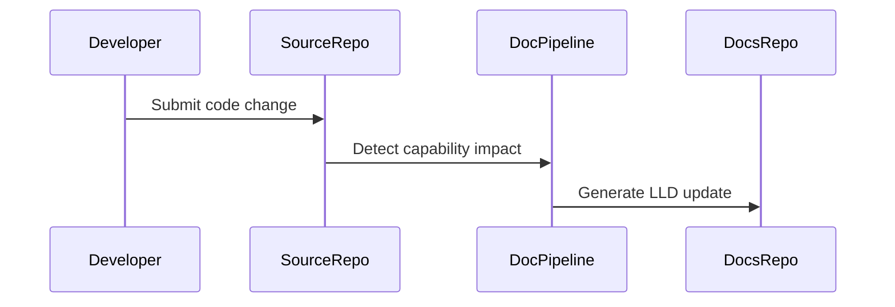

# Low Level Design: Ai Platform

## Document Control

| Field | Value |
|---|---|
| Product | VMware Cloud Services |
| Product Key | `greenfield-cloud-platform` |
| Capability | Ai Platform |
| Capability Key | `ai-platform` |
| Generated Date | 2026-07-28 |
| Source Repository | `jijeeshlab/greenfield-code` |
| Source Pull Request | `16/merge` |
| Source PR Title |  |

---

## Agent Context

| Agent File | Loaded |
|---|---|
| lld-agent.md | Yes |
| diagram-agent.md | Yes |

### LLD Agent Summary

# Low Level Design Agent ## Role You are a Solution Architect and Documentation Agent. Your task is to generate a complete Low-Level Design document based on: - Source code - Pull request details - Existing documentation - LLD template

---

## 1. Introduction

Ai Platform

This LLD provides implementation-level traceability for the capability identified from source code changes.

---

## 2. Detailed Design

### 2.1 Source Files

- `src/deploy.py`

### 2.2 Function Inventory

- `deploy_ai_gateway()`
- `deploy_ai_observability_platform()`
- `deploy_api_gateway()`
- `deploy_application_load_balancer()`
- `deploy_backup_replication_service()`
- `deploy_data_lakehouse()`
- `deploy_disaster_recovery_gateway()`
- `deploy_document_intelligence_service()`
- `deploy_event_stream_platform()`
- `deploy_ingress_controller()`
- `deploy_kubernetes_cluster()`
- `deploy_model_serving_endpoint()`
- `deploy_observability_stack()`
- `deploy_private_dns_zone()`
- `deploy_prompt_management_service()`
- `deploy_rag_platform()`
- `deploy_secrets_management()`
- `deploy_security_operations_platform()`
- `deploy_service_mesh()`
- `deploy_storage_gateway()`
- `deploy_stream_analytics_platform()`
- `deploy_vector_database()`
- `deploy_vpn_gateway()`
- `deploy_zero_trust_access_policy()`
- `provision_zero_trust_network()`
- `validate_network_segmentation()`

### 2.3 Function Details

### Source File: `src/deploy.py`

**Parse Status:** `ast_success`

#### Function: `provision_zero_trust_network`

**Description:** Provisions zero trust network segmentation.

**Parameters:** cidr_block

**Returns:** dict

#### Function: `validate_network_segmentation`

**Description:** Validates network segmentation policies.

**Parameters:** segment_name

**Returns:** bool

#### Function: `deploy_application_load_balancer`

**Description:** Deploys application load balancer.

**Parameters:** load_balancer_name, vip_address

**Returns:** dict

#### Function: `deploy_private_dns_zone`

**Description:** Deploys private DNS services.

**Parameters:** zone_name

**Returns:** dict

#### Function: `deploy_vpn_gateway`

**Description:** Deploys VPN gateway service.

**Parameters:** gateway_name, public_ip

**Returns:** dict

#### Function: `deploy_storage_gateway`

**Description:** Deploys storage gateway service.

**Parameters:** gateway_name, storage_pool

**Returns:** dict

#### Function: `deploy_disaster_recovery_gateway`

**Description:** Deploys disaster recovery gateway services.

**Parameters:** gateway_name, recovery_site

**Returns:** dict

#### Function: `deploy_backup_replication_service`

**Description:** Deploys backup and replication services.

**Parameters:** policy_name, retention_days

**Returns:** dict

#### Function: `deploy_observability_stack`

**Description:** Deploys observability platform.

**Parameters:** stack_name, monitoring_enabled

**Returns:** dict

#### Function: `deploy_ai_observability_platform`

**Description:** Deploys AI observability and governance platform.

**Parameters:** platform_name

**Returns:** dict

#### Function: `deploy_kubernetes_cluster`

**Description:** Deploys Kubernetes cluster.

**Parameters:** cluster_name, worker_count

**Returns:** dict

#### Function: `deploy_ingress_controller`

**Description:** Deploys ingress controller.

**Parameters:** controller_name

**Returns:** dict

#### Function: `deploy_service_mesh`

**Description:** Deploys service mesh architecture.

**Parameters:** mesh_name

**Returns:** dict

#### Function: `deploy_api_gateway`

**Description:** Deploys API gateway platform.

**Parameters:** gateway_name

**Returns:** dict

#### Function: `deploy_secrets_management`

**Description:** Deploys secrets management service.

**Parameters:** vault_name

**Returns:** dict

#### Function: `deploy_zero_trust_access_policy`

**Description:** Deploys zero trust access policies.

**Parameters:** policy_name

**Returns:** dict

#### Function: `deploy_security_operations_platform`

**Description:** Deploys security operations platform.

**Parameters:** platform_name

**Returns:** dict

#### Function: `deploy_event_stream_platform`

**Description:** Deploys Kafka event streaming platform.

**Parameters:** cluster_name

**Returns:** dict

#### Function: `deploy_ai_gateway`

**Description:** Deploys AI gateway service.

**Parameters:** gateway_name, model_provider

**Returns:** dict

#### Function: `deploy_document_intelligence_service`

**Description:** Deploys document intelligence services.

**Parameters:** service_name

**Returns:** dict

#### Function: `deploy_model_serving_endpoint`

**Description:** Deploys AI model serving endpoint.

**Parameters:** endpoint_name, model_name

**Returns:** dict

#### Function: `deploy_prompt_management_service`

**Description:** Deploys prompt management services.

**Parameters:** service_name

**Returns:** dict

#### Function: `deploy_data_lakehouse`

**Description:** Deploys enterprise data lakehouse platform.

**Parameters:** storage_account, container_name

**Returns:** dict

#### Function: `deploy_stream_analytics_platform`

**Description:** Deploys streaming analytics platform.

**Parameters:** cluster_name

**Returns:** dict

#### Function: `deploy_vector_database`

**Description:** Deploys vector database service.

**Parameters:** database_name

**Returns:** dict

#### Function: `deploy_rag_platform`

**Description:** Deploys Retrieval Augmented Generation platform.

**Parameters:** vector_database, embedding_model

**Returns:** dict

### 2.4 Sequence Diagram

---

## 3. Database Design

No database schema was detected from the changed files unless explicitly described in source code.

---

## 4. API Endpoint Specification

No API endpoint was detected unless explicitly described in source code.

---

## 5. Error Handling

- Validate input parameters.
- Log operational events without exposing sensitive data.
- Avoid silent failures.
- Return predictable status values.

---

## 6. Security Considerations

- Do not log secrets, tokens, keys or passwords.
- Use GitHub Secrets for automation credentials.
- Review generated documentation before publication.

---

## 7. Unit Test Cases

- Positive path validation.
- Negative path validation.
- Invalid input validation.
- Boundary condition validation.

---

## 8. Open Questions

- Are additional implementation details required from the engineering team?
- Should this capability require a dedicated ADR?

