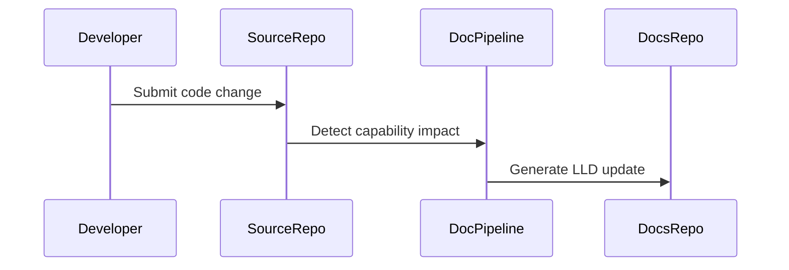

# Low Level Design: Ai Platform

## Document Control

| Field | Value |
|---|---|
| Product | My Cloud Services |
| Product Key | `greenfield-cloud-platform` |
| Capability | Ai Platform |
| Capability Key | `ai-platform` |
| Generated Date | 2026-07-30 |
| Source Repository | `jijeeshlearningorg/greenfield-code` |
| Source Pull Request | `3/merge` |
| Source PR Title |  |

---

## Agent Context

| Agent File | Loaded |
|---|---|
| lld-agent.md | Yes |
| diagram-agent.md | Yes |

### LLD Agent Summary

# Low Level Design Agent ## Role You are a Solution Architect and Documentation Agent. Your task is to generate a complete Low-Level Design document based on: - Source code - Pull request details - Existing documentation - LLD template

---

## 1. Introduction

Ai Platform

This LLD provides implementation-level traceability for the capability identified from source code changes.

---

## 2. Detailed Design

### 2.1 Source Files

- `src/deploy.py`

### 2.2 Function Inventory

- `deploy_clinical_analytics_platform()`
- `deploy_core_banking_platform()`
- `deploy_credit_processing_service()`
- `deploy_ecommerce_platform()`
- `deploy_fraud_detection_engine()`
- `deploy_inventory_tracking_platform()`
- `deploy_loan_management_platform()`
- `deploy_medical_record_service()`
- `deploy_order_management_service()`
- `deploy_patient_management_platform()`
- `deploy_payment_gateway_service()`
- `deploy_route_optimization_platform()`
- `deploy_shipment_tracking_service()`
- `deploy_warehouse_management_service()`

### 2.3 Function Details

### Source File: `src/deploy.py`

**Parse Status:** `ast_success`

#### Function: `deploy_core_banking_platform`

**Description:** Deploys core banking services.

**Parameters:** platform_name

**Returns:** dict

#### Function: `deploy_credit_processing_service`

**Description:** Deploys credit processing service.

**Parameters:** service_name

**Returns:** dict

#### Function: `deploy_loan_management_platform`

**Description:** Deploys loan management services.

**Parameters:** platform_name

**Returns:** dict

#### Function: `deploy_payment_gateway_service`

**Description:** Deploys payment gateway services.

**Parameters:** gateway_name

**Returns:** dict

#### Function: `deploy_fraud_detection_engine`

**Description:** Deploys fraud detection services.

**Parameters:** engine_name

**Returns:** dict

#### Function: `deploy_patient_management_platform`

**Description:** Deploys patient management platform.

**Parameters:** platform_name

**Returns:** dict

#### Function: `deploy_medical_record_service`

**Description:** Deploys medical record services.

**Parameters:** service_name

**Returns:** dict

#### Function: `deploy_clinical_analytics_platform`

**Description:** Deploys clinical analytics platform.

**Parameters:** platform_name

**Returns:** dict

#### Function: `deploy_ecommerce_platform`

**Description:** Deploys ecommerce services.

**Parameters:** platform_name

**Returns:** dict

#### Function: `deploy_order_management_service`

**Description:** Deploys order management services.

**Parameters:** service_name

**Returns:** dict

#### Function: `deploy_inventory_tracking_platform`

**Description:** Deploys inventory tracking platform.

**Parameters:** platform_name

**Returns:** dict

#### Function: `deploy_shipment_tracking_service`

**Description:** Deploys shipment tracking services.

**Parameters:** service_name

**Returns:** dict

#### Function: `deploy_route_optimization_platform`

**Description:** Deploys route optimization platform.

**Parameters:** platform_name

**Returns:** dict

#### Function: `deploy_warehouse_management_service`

**Description:** Deploys warehouse management services.

**Parameters:** service_name

**Returns:** dict

### 2.4 Sequence Diagram

---

## 3. Database Design

No database schema was detected from the changed files unless explicitly described in source code.

---

## 4. API Endpoint Specification

No API endpoint was detected unless explicitly described in source code.

---

## 5. Error Handling

- Validate input parameters.
- Log operational events without exposing sensitive data.
- Avoid silent failures.
- Return predictable status values.

---

## 6. Security Considerations

- Do not log secrets, tokens, keys or passwords.
- Use GitHub Secrets for automation credentials.
- Review generated documentation before publication.

---

## 7. Unit Test Cases

- Positive path validation.
- Negative path validation.
- Invalid input validation.
- Boundary condition validation.

---

## 8. Open Questions

- Are additional implementation details required from the engineering team?
- Should this capability require a dedicated ADR?

