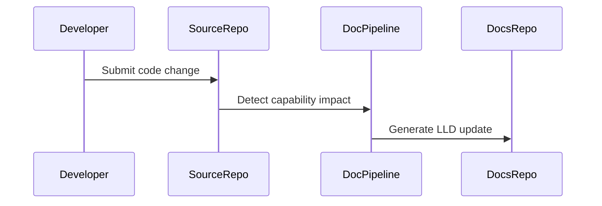

# Low Level Design: Security

## Document Control

| Field | Value |
|---|---|
| Product | My Cloud Services |
| Product Key | `greenfield-cloud-platform` |
| Capability | Security |
| Capability Key | `security` |
| Generated Date | 2026-07-30 |
| Source Repository | `jijeeshlearningorg/greenfield-code` |
| Source Pull Request | `3/merge` |
| Source PR Title |  |

---

## Agent Context

| Agent File | Loaded |
|---|---|
| lld-agent.md | Yes |
| diagram-agent.md | Yes |

### LLD Agent Summary

# Low Level Design Agent ## Role You are a Solution Architect and Documentation Agent. Your task is to generate a complete Low-Level Design document based on: - Source code - Pull request details - Existing documentation - LLD template

---

## 1. Introduction

Platform security controls, vulnerability management and compliance automation.

This LLD provides implementation-level traceability for the capability identified from source code changes.

---

## 2. Detailed Design

### 2.1 Source Files

- `src/security_vault.py`

### 2.2 Function Inventory

- `bind_customer_key()`

### 2.3 Function Details

### Source File: `src/security_vault.py`

**Parse Status:** `ast_success`

#### Function: `bind_customer_key`

**Description:** Binds a customer-managed key
to an isolated cloud environment cluster.

Args:
    kms_key_id (str):
        KMS Key Identifier

    cluster_uuid (str):
        Target Environment

Returns:
    dict:
        Status information

**Parameters:** kms_key_id, cluster_uuid

**Returns:** dict

### 2.4 Sequence Diagram

---

## 3. Database Design

No database schema was detected from the changed files unless explicitly described in source code.

---

## 4. API Endpoint Specification

No API endpoint was detected unless explicitly described in source code.

---

## 5. Error Handling

- Validate input parameters.
- Log operational events without exposing sensitive data.
- Avoid silent failures.
- Return predictable status values.

---

## 6. Security Considerations

- Do not log secrets, tokens, keys or passwords.
- Use GitHub Secrets for automation credentials.
- Review generated documentation before publication.

---

## 7. Unit Test Cases

- Positive path validation.
- Negative path validation.
- Invalid input validation.
- Boundary condition validation.

---

## 8. Open Questions

- Are additional implementation details required from the engineering team?
- Should this capability require a dedicated ADR?

