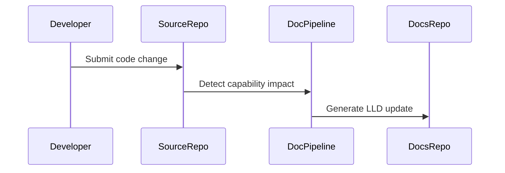

# Low Level Design: Api Service Broker

## Document Control

| Field | Value |
|---|---|
| Product | My Cloud Services |
| Product Key | `my-cloud-platform` |
| Capability | Api Service Broker |
| Capability Key | `api-service-broker` |
| Generated Date | 2026-07-31 |
| Source Repository | `jijeeshlearningorg/greenfield-code` |
| Source Pull Request | `main` |
| Source PR Title |  |

---

## Agent Context

| Agent File | Loaded |
|---|---|
| lld-agent.md | Yes |
| diagram-agent.md | Yes |

### LLD Agent Summary

# Low Level Design Agent ## Role You are a Solution Architect and Documentation Agent. Your task is to generate a complete Low-Level Design document based on: - Source code - Pull request details - Existing documentation - LLD template

---

## 1. Introduction

Service consumption layer exposing VCS functionality through APIs and service catalog.

This LLD provides implementation-level traceability for the capability identified from source code changes.

---

## 2. Detailed Design

### 2.1 Source Files

- `src/service_broker.py`

### 2.2 Function Inventory

- `create_service_offering()`
- `publish_service_catalog()`
- `register_platform_api()`
- `validate_api_subscription()`

### 2.3 Function Details

### Source File: `src/service_broker.py`

**Parse Status:** `ast_success`

#### Function: `publish_service_catalog`

**Description:** Publishes a cloud service catalog.

**Parameters:** catalog_name

**Returns:** bool

#### Function: `register_platform_api`

**Description:** Registers a new platform API endpoint.

**Parameters:** api_name

**Returns:** bool

#### Function: `create_service_offering`

**Description:** Creates a self-service catalog offering.

**Parameters:** service_name

**Returns:** bool

#### Function: `validate_api_subscription`

**Description:** Validates API consumer subscriptions.

**Parameters:** subscription_id

**Returns:** bool

### 2.4 Sequence Diagram

---

## 3. Database Design

No database schema was detected from the changed files unless explicitly described in source code.

---

## 4. API Endpoint Specification

No API endpoint was detected unless explicitly described in source code.

---

## 5. Error Handling

- Validate input parameters.
- Log operational events without exposing sensitive data.
- Avoid silent failures.
- Return predictable status values.

---

## 6. Security Considerations

- Do not log secrets, tokens, keys or passwords.
- Use GitHub Secrets for automation credentials.
- Review generated documentation before publication.

---

## 7. Unit Test Cases

- Positive path validation.
- Negative path validation.
- Invalid input validation.
- Boundary condition validation.

---

## 8. Open Questions

- Are additional implementation details required from the engineering team?
- Should this capability require a dedicated ADR?
