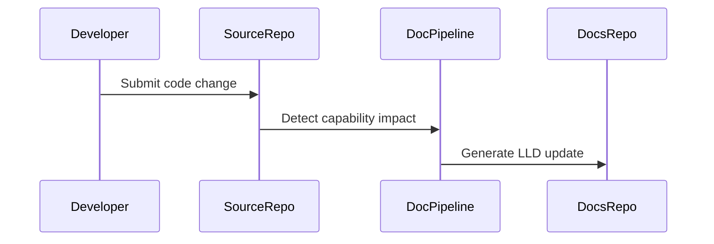

# Low Level Design: Capacity Management

## Document Control

| Field | Value |
|---|---|
| Product | My Cloud Services |
| Product Key | `my-cloud-platform` |
| Capability | Capacity Management |
| Capability Key | `capacity-management` |
| Generated Date | 2026-07-31 |
| Source Repository | `jijeeshlearningorg/brownfield-code` |
| Source Pull Request | `main` |
| Source PR Title |  |

---

## Agent Context

| Agent File | Loaded |
|---|---|
| lld-agent.md | Yes |
| diagram-agent.md | Yes |

### LLD Agent Summary

# Low Level Design Agent ## Role You are a Solution Architect and Documentation Agent. Your task is to generate a complete Low-Level Design document based on: - Source code - Pull request details - Existing documentation - LLD template

---

## 1. Introduction

Capacity Management

This LLD provides implementation-level traceability for the capability identified from source code changes.

---

## 2. Detailed Design

### 2.1 Source Files

- `src/capacity_calc.py`

### 2.2 Function Inventory

- `calculate_energy_savings()`
- `estimate_capacity_growth()`
- `generate_capacity_recommendation()`

### 2.3 Function Details

### Source File: `src/capacity_calc.py`

**Parse Status:** `ast_success`

#### Function: `calculate_energy_savings`

**Description:** Calculates estimated energy savings
after hardware consolidation.

**Parameters:** decommissioned_hosts

**Returns:** float

#### Function: `estimate_capacity_growth`

**Description:** Estimates future infrastructure capacity demand.

**Parameters:** current_cpu_usage, annual_growth_percent

**Returns:** float

#### Function: `generate_capacity_recommendation`

**Description:** Generates a capacity management recommendation.

**Parameters:** projected_cpu_usage

**Returns:** str

### 2.4 Sequence Diagram

---

## 3. Database Design

No database schema was detected from the changed files unless explicitly described in source code.

---

## 4. API Endpoint Specification

No API endpoint was detected unless explicitly described in source code.

---

## 5. Error Handling

- Validate input parameters.
- Log operational events without exposing sensitive data.
- Avoid silent failures.
- Return predictable status values.

---

## 6. Security Considerations

- Do not log secrets, tokens, keys or passwords.
- Use GitHub Secrets for automation credentials.
- Review generated documentation before publication.

---

## 7. Unit Test Cases

- Positive path validation.
- Negative path validation.
- Invalid input validation.
- Boundary condition validation.

---

## 8. Open Questions

- Are additional implementation details required from the engineering team?
- Should this capability require a dedicated ADR?
