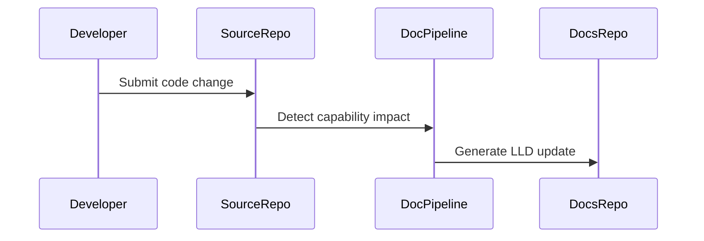

# Low Level Design: Lifecycle Management

## Document Control

| Field | Value |
|---|---|
| Product | My Cloud Services |
| Product Key | `my-cloud-platform` |
| Capability | Lifecycle Management |
| Capability Key | `lifecycle-management` |
| Generated Date | 2026-07-31 |
| Source Repository | `jijeeshlearningorg/brownfield-code` |
| Source Pull Request | `main` |
| Source PR Title |  |

---

## Agent Context

| Agent File | Loaded |
|---|---|
| lld-agent.md | Yes |
| diagram-agent.md | Yes |

### LLD Agent Summary

# Low Level Design Agent ## Role You are a Solution Architect and Documentation Agent. Your task is to generate a complete Low-Level Design document based on: - Source code - Pull request details - Existing documentation - LLD template

---

## 1. Introduction

Automated patching, upgrades and platform lifecycle operations.

This LLD provides implementation-level traceability for the capability identified from source code changes.

---

## 2. Detailed Design

### 2.1 Source Files

- `src/capacity_calc.py`
- `src/migrate.py`
- `src/patch.py`
- `src/rollback.py`
- `src/upgrade.py`
- `src/validation.py`

### 2.2 Function Inventory

- `apply_security_patch()`
- `assess_upgrade_readiness()`
- `calculate_energy_savings()`
- `check_patch_compliance()`
- `create_restore_point()`
- `create_upgrade_plan()`
- `estimate_capacity_growth()`
- `evacuate_virtual_machines()`
- `execute_rollback()`
- `generate_capacity_recommendation()`
- `generate_validation_report()`
- `migrate_legacy_hardware_node()`
- `validate_backup_status()`
- `validate_migration_prerequisites()`
- `validate_monitoring_status()`
- `validate_patch_success()`
- `validate_platform_health()`
- `validate_post_upgrade()`
- `verify_rollback_status()`

### 2.3 Function Details

### Source File: `src/capacity_calc.py`

**Parse Status:** `ast_success`

#### Function: `calculate_energy_savings`

**Description:** Calculates estimated energy savings
after hardware consolidation.

**Parameters:** decommissioned_hosts

**Returns:** float

#### Function: `estimate_capacity_growth`

**Description:** Estimates future infrastructure capacity demand.

**Parameters:** current_cpu_usage, annual_growth_percent

**Returns:** float

#### Function: `generate_capacity_recommendation`

**Description:** Generates a capacity management recommendation.

**Parameters:** projected_cpu_usage

**Returns:** str

### Source File: `src/migrate.py`

**Parse Status:** `ast_success`

#### Function: `migrate_legacy_hardware_node`

**Description:** Performs migration of a legacy server workload
into the modernized infrastructure platform.

**Parameters:** server_id, target_zone

**Returns:** bool

#### Function: `evacuate_virtual_machines`

**Description:** Evacuates virtual machines before maintenance or migration.

**Parameters:** cluster_name

**Returns:** bool

#### Function: `validate_migration_prerequisites`

**Description:** Validates migration prerequisites including backups,
network connectivity and platform readiness.

**Parameters:** server_id

**Returns:** bool

### Source File: `src/patch.py`

**Parse Status:** `ast_success`

#### Function: `check_patch_compliance`

**Description:** Verifies whether patch levels comply with enterprise standards.

**Parameters:** platform_version

**Returns:** bool

#### Function: `apply_security_patch`

**Description:** Applies a security patch to the target environment.

**Parameters:** patch_id

**Returns:** bool

#### Function: `validate_patch_success`

**Description:** Validates that the patch completed successfully.

**Parameters:** patch_id

**Returns:** bool

### Source File: `src/rollback.py`

**Parse Status:** `ast_success`

#### Function: `create_restore_point`

**Description:** Creates a rollback restore point before change execution.

**Parameters:** target_system

**Returns:** bool

#### Function: `execute_rollback`

**Description:** Executes rollback procedure for failed lifecycle activities.

**Parameters:** target_system

**Returns:** bool

#### Function: `verify_rollback_status`

**Description:** Verifies rollback success.

**Parameters:** target_system

**Returns:** bool

### Source File: `src/upgrade.py`

**Parse Status:** `ast_failed_regex_fallback`

#### Function: `assess_upgrade_readiness`

**Description:** Function detected by fallback parser.

**Parameters:** current_version, target_version

**Returns:** Not detected

#### Function: `create_upgrade_plan`

**Description:** Function detected by fallback parser.

**Parameters:** target_version

**Returns:** Not detected

#### Function: `validate_post_upgrade`

**Description:** Function detected by fallback parser.

**Parameters:** None

**Returns:** Not detected

### Source File: `src/validation.py`

**Parse Status:** `ast_failed_regex_fallback`

#### Function: `validate_platform_health`

**Description:** Function detected by fallback parser.

**Parameters:** None

**Returns:** Not detected

#### Function: `validate_monitoring_status`

**Description:** Function detected by fallback parser.

**Parameters:** None

**Returns:** Not detected

#### Function: `validate_backup_status`

**Description:** Function detected by fallback parser.

**Parameters:** None

**Returns:** Not detected

#### Function: `generate_validation_report`

**Description:** Function detected by fallback parser.

**Parameters:** None

**Returns:** Not detected

### 2.4 Sequence Diagram

---

## 3. Database Design

No database schema was detected from the changed files unless explicitly described in source code.

---

## 4. API Endpoint Specification

No API endpoint was detected unless explicitly described in source code.

---

## 5. Error Handling

- Validate input parameters.
- Log operational events without exposing sensitive data.
- Avoid silent failures.
- Return predictable status values.

---

## 6. Security Considerations

- Do not log secrets, tokens, keys or passwords.
- Use GitHub Secrets for automation credentials.
- Review generated documentation before publication.

---

## 7. Unit Test Cases

- Positive path validation.
- Negative path validation.
- Invalid input validation.
- Boundary condition validation.

---

## 8. Open Questions

- Are additional implementation details required from the engineering team?
- Should this capability require a dedicated ADR?
